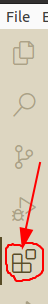

# 00.030 Installing Visual Studio Code

Our editor this semester with be Visual Studio Code.  It is also called "VS Code" or just "code"

Code is a free program from Microsoft.

Download and install VS Code from [https://code.visualstudio.com/download](https://code.visualstudio.com/download)

I will let you handle the install on your own.

## Video Studio Code

Some people will have used VS Code in ACT 102 or some other situation.  There are a number of good VS Code tutorials on YouTube.  

### Optional overview of VS Code

Here is one tutorial. The good stuff starts at 1:37, and this link takes you there.[https://youtu.be/ORrELERGIHs?t=97](https://youtu.be/ORrELERGIHs?t=97)  Don't install the extensions shown in the vide, at least not yet.  Don't worry about remembering everything in the video.  We will hit these topics later in the course.

## Adding extensions

Open VS Code and add the extensions we need for this course.  Begin by clicking on the Extension tab on the left margin.

 

 Add the following extensions.  Search for the name, but check for the author as well.  It is important to check the author because several extensions may have the same name.

 * Python by Microsoft
 * Prettier Code formatter by Prettier
 * Code Spell Checker by Street Side Software

 ## The thing that it is hardest for new developers to do.

 Where we are developing software we usually work in directories or folders.  But novice programmers think in terms of files.  

 VS Code works in terms of directories.  So do not open files; open folders.